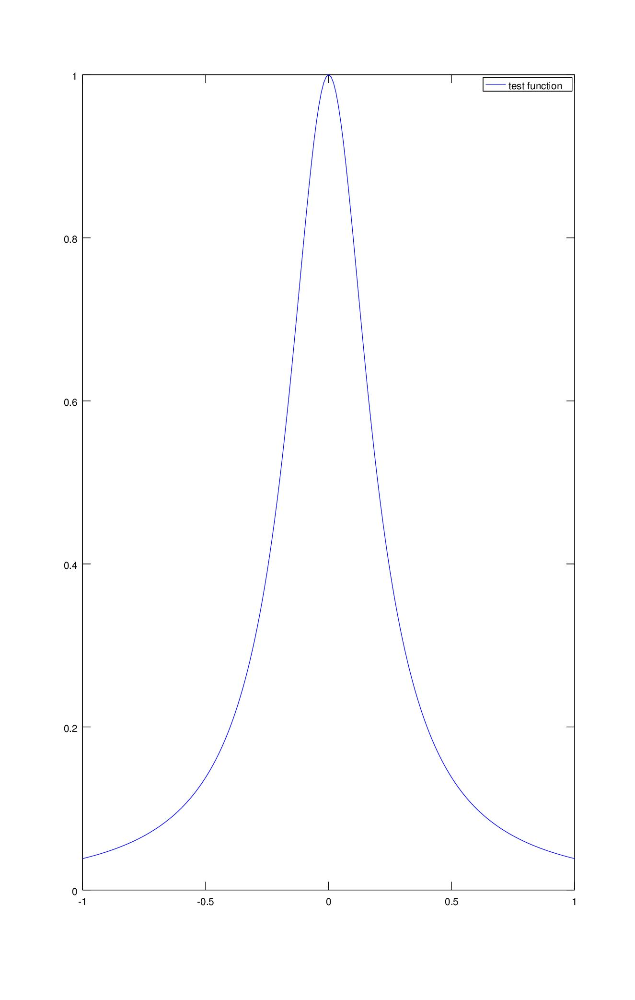

# Least Squares

The method of least squares is a standard approach in regression analysis to
the approximate solution of overdetermined systems, i.e. set of equations in
which there are more equations than unknowns. Least squares means that the
overal solution minimizes the sum of the squares of the errors made in the
results of every single equation.

The most important application is in ddata fitting. The best fit in the
least-squares sense minimizes the sum of the squared residuals (aka errors),
a residual being the difference between an observed value and the fitted value
provided by a model. When the problem has substantial uncertainties in the
independent variable, then simple regression and least squares method have
problems; in such cases, the methodology required for fitting
errors-in-variables models maybe considered instead of that for least squares.

Least squares works if we have a problem in the form:

\begin{equation}
    Ax = b
\end{equation}

Where we wish to determine what $x$ is. If $A$ is a skinny matrix ($n > m$) the
problem is over-constrained (no solution exists). Instead, we can minimize the
square error between $Ax$ and $b$.

\begin{equation}
    \text{min}_{x} || \text{error} ||^{2}_{2}
\end{equation}

\begin{equation}
    \text{min}_{x} || Ax - b ||^{2}_{2}
\end{equation}

\begin{equation}
    \text{min}_{x} \left( (Ax - b)^{T} (Ax - b) \right)
\end{equation}

\begin{equation}
    \text{min}_{x} \left( x^{T} A^{T} - 2b^{T}Ax + b^{T}b \right)
\end{equation}

The smallest error is when the derivative of the error is 0, and so:

\begin{equation}
    \frac{d}{dx} \left( x^{T} A^{T} - 2b^{T}Ax + b^{T}b \right) = 0
\end{equation}

\begin{equation}
    \left( 2x^{T} A A^{T} - 2b^{T}A \right) = 0
\end{equation}

\begin{equation}
    A A^{T} x = A^{T} b
\end{equation}

\begin{equation}
    x = (A^{T} A)^{-1}(A^{T} b)
\end{equation}

\begin{equation}
    x = A^{\dagger} b
\end{equation}

where $A^{\dagger}$ is the **Pseudo Inverse** $A^{\dagger} = (A^{T} A)^{-1}
A^{T}$

## Example: Data Fitting

Suppose we have this test function:

\begin{equation}
    g(t) = \frac{1}{1 + 25t^{2}}
\end{equation}

This produces a plot that looks like the following:

